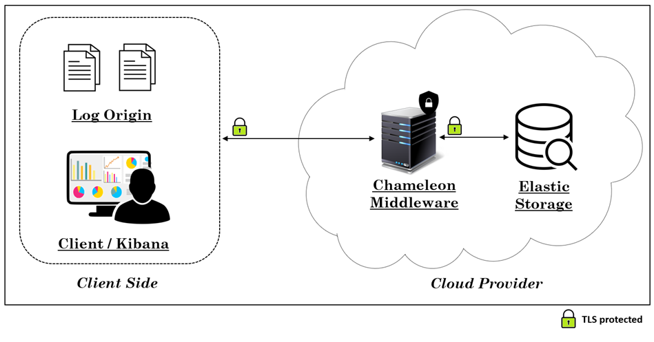
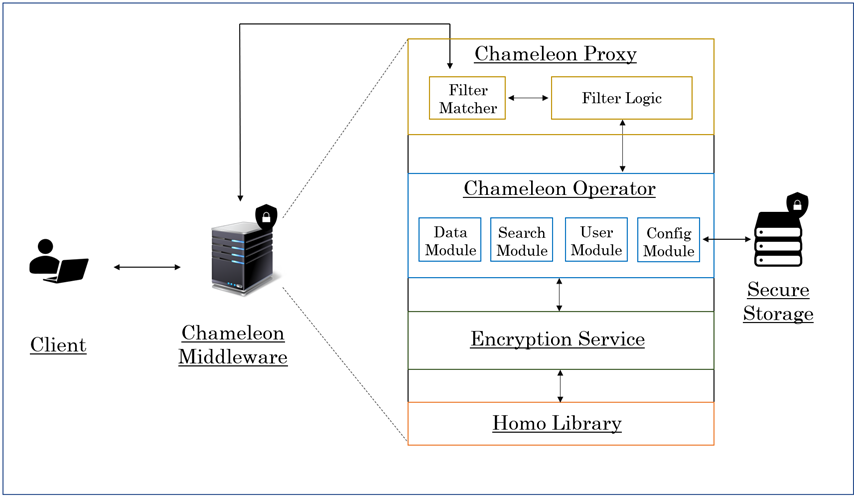

# Chameleon: A Secure Cloud-Enabled and Queryable System with Elastic Properties

Prototype of the Chameleon System, a proxy middleware capable of providing data analysis upon ciphered documents stored in Elasticsearch. 
Prototype derived from the underlying Master Thesis [[1](#thesis)] written and implemented by [João Santos](https://www.linkedin.com/in/jsantos-js/).

## Motivation
Nowadays, applicational logging and the use of cloud-based services are a recurring solution when it comes to managing critical business applications. Resorting to cloud
computing for data storage is often the most cost effective way of dealing with this issue, given how easily it shifts the responsibility of storage management to the cloud provider. Besides the given point, the use of cloud computing to host logs or common records provides an accessible manner for its use and analysis, at any given time. Some of these stored records might be considered sensitive, potentially revealing and often dangerous in the wrong hands.
The convenience of using cloud-storage services does not come without a price. Choosing to trust a cloud provider means accepting the fact that our data might, or might not,
be entirely secure when it comes to all kinds of events. Happenings of this sort can be
categorized as Data leaks, common malicious attacks and the existence of an honest-but-curious cloud administrator.

Following the idea that logs and other critical data could potentially lead to unwanted outccomes when not secure, it stands to point that a cloud-based service must ensure privacy,
authenticity and integrity of all its given contents. All these requirements must be fulfilled while still supporting the ability to audit the system by authorized principals. This
task could be easily implemented by the raw use of Homomorphic Encryption and
Searchable Encryption by end users, which would allow for secure logging storage
in the cloud. This solution alone, however, is not ideal for embedded usage in analytical
frameworks, due to its complex and restrictive operation set. Platforms implementing
real-time analysis of data streams, such as Elastic Stack, should be able to incorporate near
full-fledged querying on encrypted data in a trivial and efficient manner, diminishing the
previously mentioned trade-off between secure data and performance/usability.

Taking this into consideration, support for efficient and user friendly full-fledged
querying on ciphered data should be provided, thus mitigating potential security leaks.

## Our Solution: Chameleon

The solution for our problem targets the necessary steps of the design, prototype and
cloud-deployment, accomplishing our goal of providing a stackable system for a privacy-enhancing elastic storage solution. This solution is based on isolated and virtualized
components, orchestrated in a well-defined environment, resulting in a deployable Cloud-enabled PaaS
solution.
Chameleon provides a reliable, secure and elastic
searchable storage system. Its focus lies on handling documents in JSON format, stored
as encrypted JSON documents with cryptographic formats, uploaded from any logging
source. The designed solution ensures the necessary tools for data analysis, providing an
extensible middleware to an analytics engine, supporting queries on the ciphered JSON
documents. Chameleon is designed to support a rich array of queries with semantics
similar to those found on reference elastic storage solutions.

### Main Features:
* A Stackable system for a privacy-enhancing elastic storage
* Restful, Distributed and Scalable
* Deployable as a Cloud-Enabled PaaS solution
* Provides tools for secure log-analysis through an extensible middleware and analytics engine
* Supports Infinit Depth JSON Document encryption, allowing multiple encryptions per field
* Handles any number of JSON schemas on the fly
* Scales with ease

### System Model and Architecture

#### System Model Overview:

#### Architectural Components Overview:

#### Components Summary:
* __Chameleon Proxy__: Acts as a proxy which filters requests and extracts the necessary data to be processed by the Chameleon Operator.
* __Chameleon Operator__: Responsible for applying the necessary logic to the received Input (Parsing, Encryption, Decryption, CRUDs)
  * __Data Module__: Encryption and Decryption of Document based operations.
  * __Search Module__: Parsing and transforming incoming queries into its encrypted form.
  * __User Module__: Security Module CRUDs of the Native Realm.
  * __Config Module__: Creation and configuration of the encrypted schema for a given index.
* __Encryption Service__: Parses any given JSON document and Encrypts/Decrypts it according to the provided encrypted schema.
* __Homo Library__: Underlying Cypto Module used for encryption of JSON documents. (Exact Matching, Word Search, Random, Range, Addition, Multiplication) 

### Supported Encrypted Operations with Elasticsearch
* __Search API__: returns search hits that match the query defined in the request.
  * __Full-text__: match, match_phrase, multi_match and combined_fields;
  * __Compound__: Boolean;
  * __Term level__: Range, Term and Terms;
  * __Aggregations__: Min, Max, Sum and Avg.
* __Asynch Search API__: The async search API lets you asynchronously execute a search
request, monitor its progress, and retrieve partial results as they become available.
Supports the same queries as the Search API.
* __Documents API__:
  * __Bulk__: Perform a certain action on several documents at once;
  * __Index__: Index (insert) an encrypted document;
  * __Get__: Retrieve an encrypted document
* __Security API__:
  * __Create User__: Insert an encrypted user into the Native Realm;
  * __Get User__: Retrieve an encrypted user from the Native Realm;
  * __Delete User__: Delete an encrypted user from the Native Realm.

## How to Play with my Prototype

### Tested Prototype requires
* Java 11
* Elasticsearch 7.+
* Maven 3.6.3
* Docker 20.10.7
* Kubernetes 1.19+.

#### Kubernetes Deployment (Recommended)
The stable deployment version requires a Kubernetes Cluster, either a remote cloud-based cluster or a local emulator, such as [Minikube](https://minikube.sigs.k8s.io).

Folder [Kubernetes_Deployment](Kubernetes_Deployment) contains two configuration files which should be updated accordingly (System resources, replicas, etc.)
* ECK.yaml : Responsible for configuring the desired state of Elasticsearch cloud
* chamelelon.yaml: Responsible for configuring the desired state of our solution Chameleon

Script [chameleon-deployment.sh](chameleon-deployment.sh) should be run on in its current folder to create and deploy Chameleon and Elasticsearch on the Kubernetes cluster.

## References
<a name="thesis">1.</a> João Santos. Chameleon: A Secure Cloud-Enabled and Queryable System with Elastic Properties, MSc Thesis. Universidade Nova de Lisboa, 2021.
